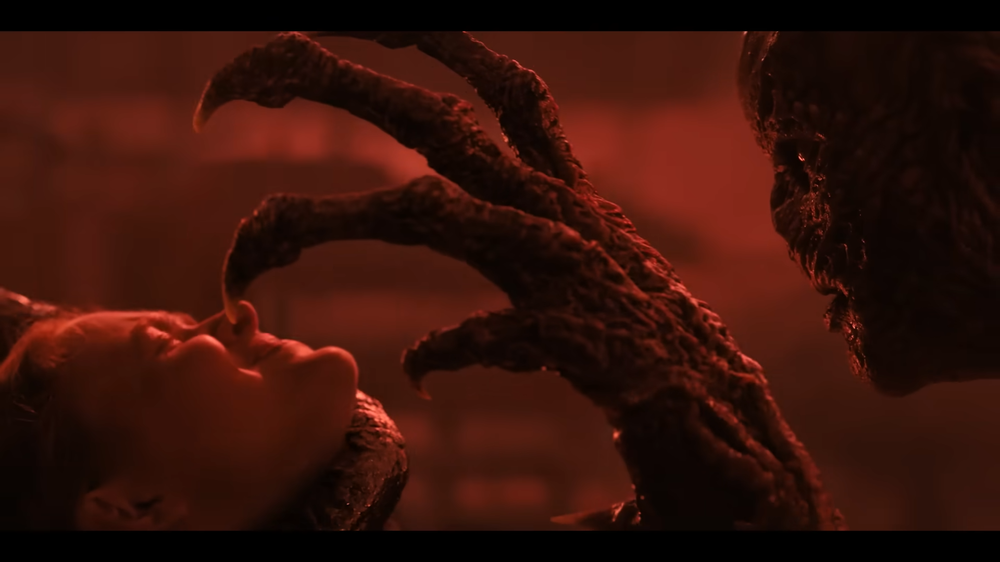

Trong thời gian chờ đợi final season của TV series Stranger Things, mình vô tình được Youtube gợi ý Running Up That Hill (Kate Bush), bài hát gắn liền với cảnh phim nổi tiếng trong E4-S4 (Dear Billy), có tên là Max's song. Sau khi xem lại một lần nữa cảnh phim này, và dành một chút thời gian suy nghĩ thì mình mới thấy được ẩn ý sâu xa đằng sau, cái mình đã bỏ sót ở lần đầu xem (do quá tập trung vào tình tiết gay cấn của phim)

### Phân tích

Trong phân cảnh này, Max, một trong những nhân vật chính trong series, chịu tổn thương sâu sắc về mặt tinh thần sau cái chết của anh trai Billy, dẫn tới hình thành hội chứng PTSD, trầm cảm, gần như đã bị Vecna (phản diện chính trong series) chiếm đoạn phần nguồn sống còn lại bên trong.
Hình ảnh Max nổi trên không trung, cổ ngước lên và hai bàn tay chỉ xuống đất, là ẩn dụ cho việc 1 người treo cổ tự vẫn bằng dây thừng, tự chấm dứt cuộc sống để giải thoát khỏi đau khổ và sự nặng nề vô hình to lớn bên trong. Người ta sẽ thắc mắc tại sao phải sử dụng hình thức cực đoan nhất này, nhưng nếu có thể trải nghiệm cảm giác của những con người đó, chúng ta mới thực sự thấu hiểu được nỗi sầu khổ và vô vọng kéo dài, khi bóng đen đó xâm chiếm toàn bộ bên trong, dường như đó là lối thoát duy nhất.

Nói một chút về phản diện chính của series, Vecna là đại diện cho bóng tối bên trong mỗi người, cũng như là một biểu trưng cho chủ nghĩa hư vô (*Nihilism*), người theo chủ nghĩa hư vô tin rằng cuộc sống không có ý nghĩa và giá trị nội tại, từ đó sự tồn tại của con người thật nhỏ bé và không có mục đích, luôn nhìn về những mặt tiêu cực trong cuộc sống hiện sinh, có thể thấy rõ được điều đó qua đoạn monologue của nhân vật này:

> *"... Where others saw order, I saw a straitjacket. A cruel, oppressive world dictated by made-up rules. Seconds, minutes, hours, days, weeks, months, years, decades. Each life a faded, lesser copy of the one before. Wake up, eat, work, sleep, reproduce, and die. Everyone is just waiting. Waiting for it all to be over. All while performing in a silly, terrible play, day after day. I could not do that. I could not close off my mind and join in the madness..."*

Nói về phạm trù tư tưởng như chủ nghĩa hư vô thì không có đúng hay sai, nó chỉ là cách nhìn, lối suy nghĩ của một ai đó về cuộc sống của họ, thế nhưng, lỗi suy nghĩ này rất nguy hiểm, đặc biệt khi vừa trải qua một biến cố, hay sang chấn nặng nề ảnh hưởng tâm lý, nó làm chúng ta càng lún sâu hơn vào hố đen sâu thẳm.

**Vậy điều gì đã giúp Max chiến thắng được Vecna?**

Chính là những điều có ý nghĩa thực sự đối với Max, là những người bạn, với sự chân thành, quan tâm, đồng cảm và thấu hiểu. Chính sự tồn tại của Max cũng là ý nghĩa to lớn đối với họ.

*"I'm still here"*, - Lucas nói với Max.

Chính những điều này sẽ chiếu rọi một tia sáng len lỏi vào hố đen bóng tối kia, tạo nên một sức mạnh tác động tới nội tại, khiến họ để có thể tự giải thoát bản thân và đi tìm ý nghĩa của cuộc sống.

Cuộc sống này vốn dĩ không có ý nghĩa, nhưng sự tồn tại của mỗi người chính là ý nghĩa của nó, chúng ta sống để tự tạo nên ý nghĩa cho bản thân và những người xung quanh!

