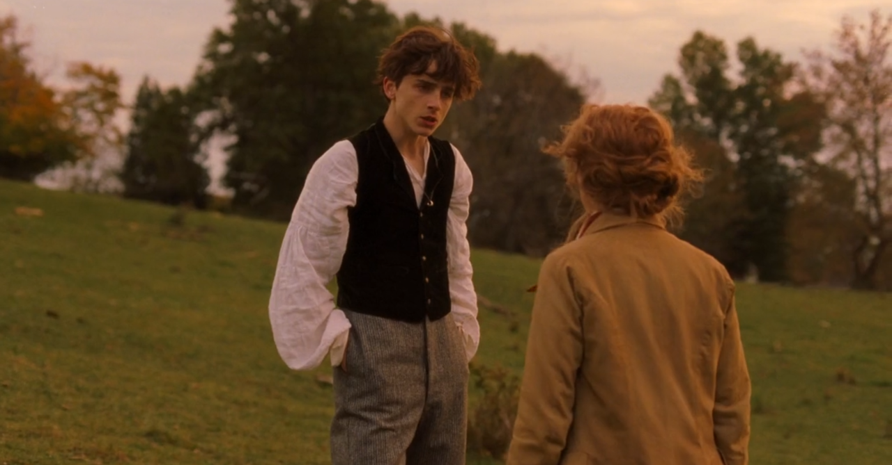

**[SPOLER ALERT]** 
Mới đây mình mới xem một bộ phim khá hay có tên là Little Women (2019) được chuyển thể từ tiểu thuyết cùng tên của nhà văn người Mỹ Louisa May Alcott.  
Little Women kể về cuộc sống gia đình của bốn chị em nhà March tại một thị trấn nhỏ của New England. Meg, cô chị cả xinh đẹp và mơ ước trở thành một quý bà. Jo, với tuổi mười lăm, lóng ngóng và không thích bị gò bó trong những nghi thức do xã hội ấn định, cô có tham vọng trở thành văn sĩ. Beth là một cô bé mười ba tuổi, người có tính cách ổn hòa nhất, thích âm nhạc, sau đó chết do sốt ban đỏ. Và Amy, một cô gái tóc vàng xinh đẹp, mười hai tuổi, có phần bưởng bỉnh và trẻ con. Theo dõi bộ phim chúng ta có thể cảm nhận được cuộc sống thường ngày mà một gia đình thuộc tầng lớp trung lưu, đồng thời đồng cảm với những khó khăn, vấn đề mà những người con gái trong gia đình đó phải đối mặt.

*Meg-Amy-Jo-Beth*

Nhưng điều khiến mình tập trung và suy nghĩ nhiều nhất sau khi xem xong đó là câu chuyện giữa Jo và Laurie, người bạn hàng xóm khôi ngô, nhà giàu, họ lần đầu gặp nhau và làm quen tại một buổi tiệc, kể từ đó Laurie dần nảy sinh tình cảm với Jo, Laurie đã yêu Jo từ cái nhìn đầu tiên. Vì là hàng xóm nên 2 người thường có cơ hội gặp gỡ nhau, họ trở nên thân thiết hơn, tuy nhiên dường như chỉ có tình cảm từ phía Laurie, trong nhiều phân cảnh chúng ta chỉ thấy ánh mắt của Laurie nhìn Jo một cách trìu mến, mà không thấy được điều ngược lại từ Jo dành cho Laurie.

Sau buổi tiệc kết hôn của Meg, Laurie và Jo dẫn nhau ra bãi cỏ sau nhà, ở đây cuối cùng Laurie cũng thổ lộ cảm xúc của mình dành cho Jo và bị từ chối:

***Laurie:***
>*"It’s no use Jo; we’ve got to have it out..I’ve loved you ever since I’ve known you Jo – I couldn’t help it, and you’ve been so good to me – I’ve tried to show it but you wouldn’t let me; now I’m going to make you hear and give me an answer because I can’t go on like this any longer...I’ve worked hard to please you, and I gave up billiards and everything you didn’t like, and waited and never complained for I hoped you’d love me, though I’m not half good enough"*

***Jo:***
>*"Yes, you are, you’re a great deal too good for me, and I’m so grateful to you and so proud of you, I don’t see why I... I can’t love you as you want me to...I can’t change the feeling and it would be a lie to say I do when I don’t"...I’d hate elegant society and you’d hate my scribbling and we would be unhappy...*

Một phân cảnh khá là heartbreaking cho Laurie và người xem, tuy nhiên cảm xúc là những kẻ không nói dối, Jo chỉ coi Laurie là bạn, một người anh/em trai mà cô chưa từng có, cô viết rất nhiều và ước mơ trở thành một nhà văn, nên thường tâm hồn Jo luôn khao khát sự tự do, ghét việc bị gò bó khi phải làm một người vợ, đặc biệt là khi còn trẻ, cô chưa sẵn sáng cho 1 cuộc hôn nhân. Bên cạnh đó, trong gia đình chỉ toàn chị em gái, Jo hiện lên như một người mạnh mẽ, có nhiều tính nam nhất, có thể gọi là 1 tomboi (có phân cảnh Jo phải cắt tóc ngắn để bán có tiền mua vé xe cho mẹ đi chăm sóc bố), nên dường như không có thứ tình cảm lãn mạn Jo dành cho Laurie.

Sau lần đó, Jo chuyển tới New York để dạy học, bảy năm trôi qua Jo dần cảm thấy cô đơn và thường hồi tưởng lại những ký ức với Laurie, sau khi biết tin em gái Beth bệnh nặng, cô bắt buộc và trở lại quê nhà, tại đây Jo có một đoạn đối thoại với mẹ cô rằng cô cảm thấy cô đơn và một được yêu, nhưng mẹ cô bảo rằng đó không phải là tình yêu, từ đây chúng ta có 1 đoạn monolouge đáng suy nghĩ của Jo:

>*"Women, they have minds, and they have souls, as well as just hearts. And they’ve got ambition, and they’ve got talent, as well as just beauty. I’m so sick of people saying that love is all a woman is fit for. I'm so sick of this, but I'm so lonely"*

Cho dù bạn có cố gắng, gồng mình và mạnh mẽ đến mấy thì bạn sẽ luôn cảm thấy cô đơn, càng lớn lên và già đi chúng ta sẽ càng thấy cô độc giống như Jo, thừa nhận sự cô đơn của mình có lẽ là điều khó khăn nhất mà Jo từng làm. Khó hơn việc từ chối Laurie, khó hơn việc đánh mất bản thảo, khó hơn việc rời bỏ gia đình để theo đuổi sự nghiệp, khó hơn tất cả những điều đó.

Cô nói với mẹ rằng nếu Laurie đến với cô thêm một lần nữa thì lần này cô sẽ đồng ý. Tuy nhiên, sau bảy năm qua, Laurie cũng đã move on, và đã yêu Amy - em gái của Jo, người mà thực sự yêu Laurie, mặc dù tình yêu của Laurie dành cho Jo vẫn mãi còn đó, nhưng nó rất khác so với tình yêu dành cho Amy.

Tóm lại, Jo và Laurie sẽ không bao giờ đến được với nhau. Có thể là do sai thời điểm, nhưng cũng có thể là do họ quá giống nhau. (Hai Yins). Mỗi người trong số họ phải tìm ra 'Yang' của mình. Đối với Jo, điều này đến từ Giáo sư Bhaer, người đã thúc đẩy cô theo những cách mà cô không quen. Đối với Laurie, Amy chỉ đơn giản là “phù hợp” và cho anh ấy một mục đích. Và với những người nói rằng “x không xứng đáng với y” hay bất cứ điều gì, mình không đồng ý. Mỗi người trong chúng ta sống không phải để xứng đáng với ai đó hay không. Mọi người đều có mục đích và nghĩa vụ riêng… Cho dù ‘nghĩa vụ’ đó là đối với xã hội hay bản thân họ.